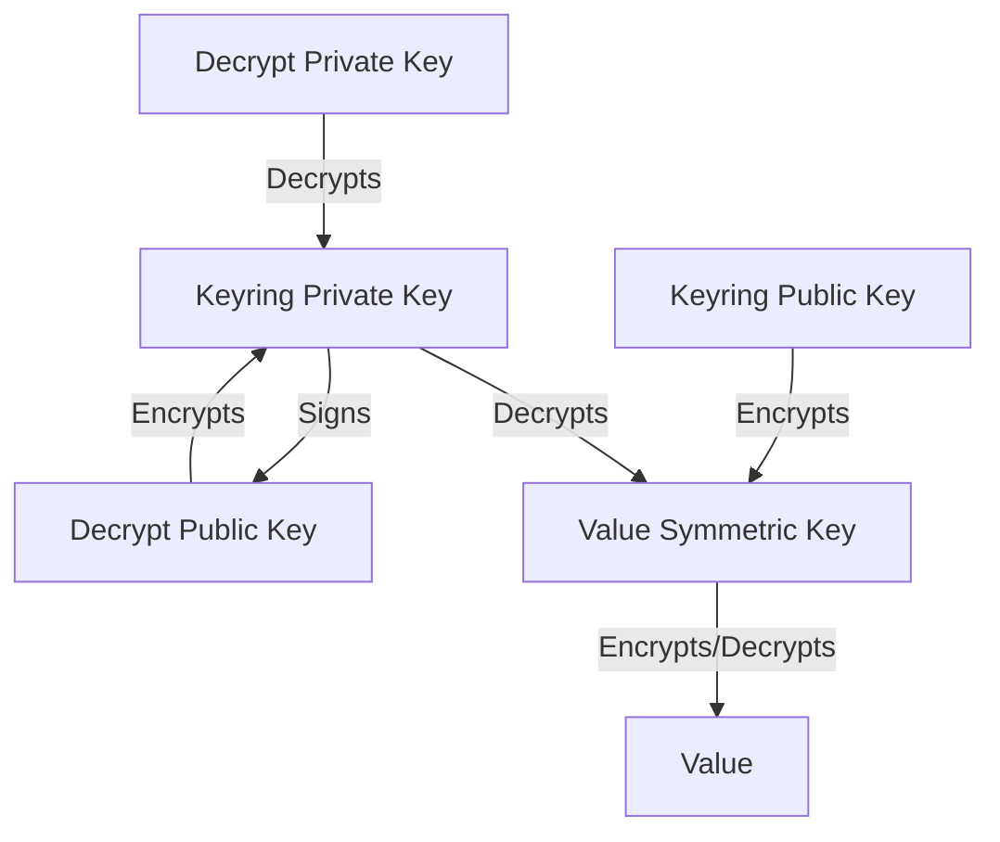

---
categories:
- explanation
description: How Rot wraps secrets
title: Secret Wrapping
weight: 10
---

Rot uses multiple layers of secrets wrapping to limit key-reuse and enable one-way encryption:

With this setup, users can encrypt **Values** without decrypting the **Keyring Private Key**.  Additionally, users can easily rekey all of the **Values** using the registered **Decrypt Public Keys**.  Rot will also check the signature of all **Decrypt Public Keys**, ensuring no one can tamper or add new keys out of band.
